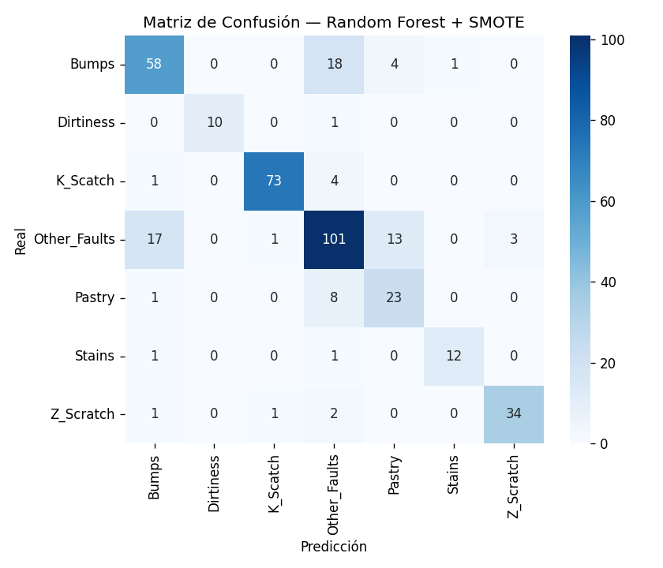
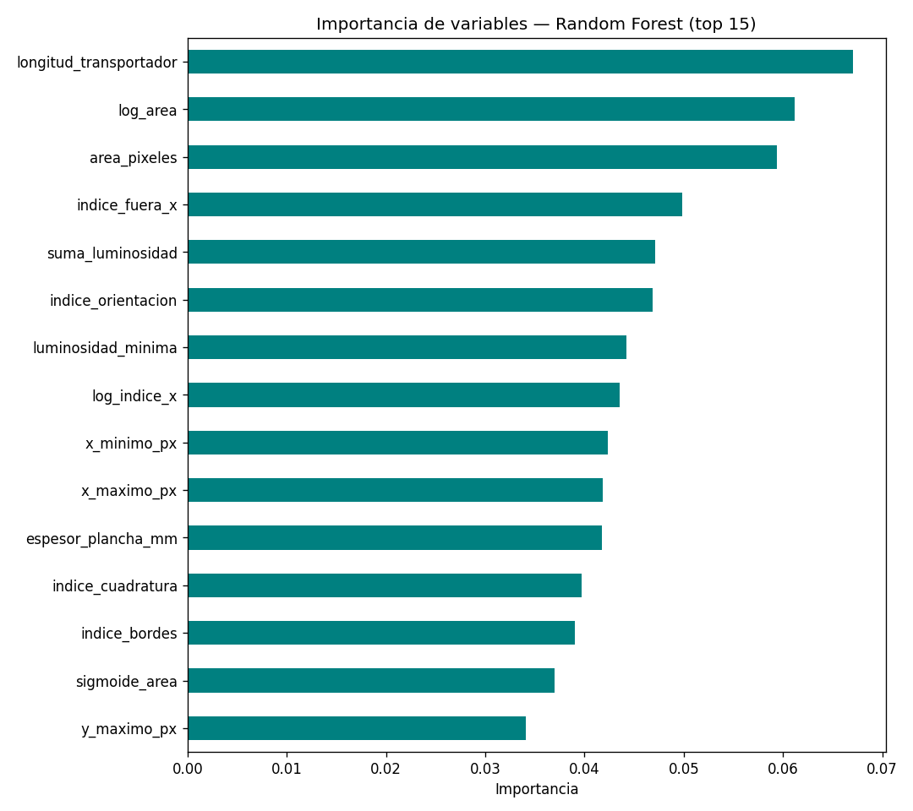
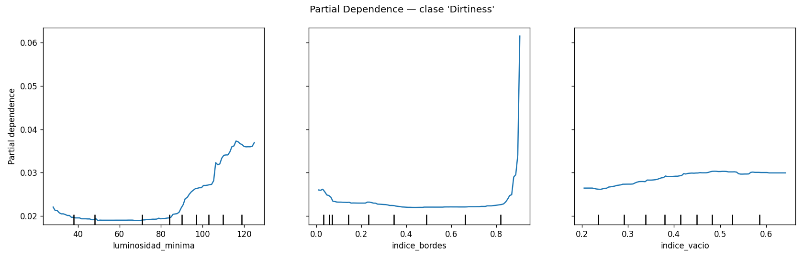
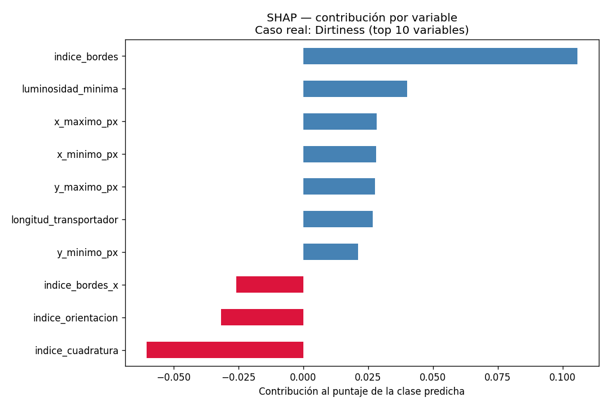

# Clasificación de Fallas Superficiales en Planchas de Acero Estructural mediante Machine Learning

**Entrega T3 — Implementación, Resultados y Presentación Final**
Curso: Aplicaciones de IA en Estructuras — Docente: Ing. Kurt Soncco Sinchi
Universidad Peruana de Ciencias Aplicadas (UPC), Julio 2026

> 📄 Este documento es la versión legible directamente en GitHub del informe final. La versión formal en formato artículo IEEE (dos columnas, para entrega oficial) está en [`Informe_T3_IEEE.docx`](./Informe_T3_IEEE.docx).

---

## Resumen

Este trabajo aborda la clasificación automática de fallas superficiales en planchas de acero estructural mediante Machine Learning, utilizando el dataset público *Steel Plates Faults* (UCI Machine Learning Repository). Se compararon cuatro configuraciones de modelo — SVM como línea base, Random Forest, XGBoost y Random Forest con remuestreo SMOTE — evaluadas mediante F1-macro y balanced accuracy dado el desbalance de clases identificado en el análisis exploratorio (T2). El modelo **Random Forest con SMOTE** obtuvo el mejor desempeño (**F1-macro = 0.831**), superando al baseline SVM (F1-macro = 0.737). Se aplicaron además técnicas de interpretabilidad (Partial Dependence Plots y SHAP) enfocadas en el par de clases más confundible identificado en el EDA, `Stains` y `Dirtiness`.

**Términos clave:** Machine Learning, control de calidad, acero estructural, clasificación multiclase, Random Forest, SMOTE, interpretabilidad, SHAP.

---

## I. Introducción

El acero estructural es uno de los materiales base más utilizados en la construcción de edificaciones, puentes y naves industriales. Durante su proceso de laminado, las planchas pueden desarrollar defectos superficiales que comprometen su resistencia mecánica y su desempeño estructural. Detectar y clasificar estos defectos a tiempo es fundamental para el control de calidad en la industria siderúrgica, tradicionalmente dependiente de inspección visual humana.

Este trabajo, desarrollado en tres entregas escalonadas (T1, T2 y T3) siguiendo el marco *Veridical Data Science* (VDS) de Yu y Barter [2], tiene como objetivo evaluar si es posible clasificar automáticamente el tipo de falla superficial de una plancha de acero, entre 7 categorías posibles, a partir de indicadores geométricos y de luminosidad extraídos por un sistema de inspección óptica.

---

## II. Metodología

### A. Dataset

Se utilizó el dataset *Steel Plates Faults* [1], desarrollado por el Semeion Research Center (Italia) y publicado en el UCI Machine Learning Repository (DOI [10.24432/C5J88N](https://doi.org/10.24432/C5J88N)). Contiene **1,941 planchas de acero** inspeccionadas, con **27 variables predictoras** numéricas (geometría del defecto, luminosidad, tipo e índices de forma) y una variable objetivo categórica con 7 clases: `Pastry`, `Z_Scratch`, `K_Scatch`, `Stains`, `Dirtiness`, `Bumps` y `Other_Faults`. El dataset no presenta valores nulos ni duplicados (ver [`data/steel_plates_faults.csv`](../data/steel_plates_faults.csv)).

El análisis exploratorio (T2, ver [`notebooks/EDA_T2.ipynb`](../notebooks/EDA_T2.ipynb)) identificó dos hallazgos determinantes para el diseño experimental:
- Un **desbalance de clases** marcado (`Other_Faults` = 34.7% de los casos, `Dirtiness` = 2.8%).
- **Multicolinealidad** fuerte entre varias variables (p. ej. `y_minimo_px` con `y_maximo_px`, r ≈ 1.0).

### B. Preparación de datos

Se realizó una partición train/test (80/20) **estratificada por clase**, para preservar la proporción de cada tipo de falla en ambos conjuntos dado el desbalance observado. Como estrategia complementaria de manejo del desbalance, se generó una variante adicional aplicando **SMOTE** [3] exclusivamente sobre el conjunto de entrenamiento, después de la partición, para evitar fuga de información hacia el conjunto de prueba.

### C. Algoritmos evaluados

Con base en la multicolinealidad detectada, se priorizaron modelos basados en árboles, robustos a este fenómeno frente a modelos lineales:

| Algoritmo | Rol | Justificación |
|---|---|---|
| **Random Forest** | Modelo principal | Robusto a multicolinealidad; feature importance interpretable |
| **XGBoost** | Modelo de comparación | Mayor capacidad predictiva potencial |
| **SVM (RBF)** | Baseline | Más simple, sensible al escalado |

Se descartaron algoritmos de clustering, por tratarse de un problema supervisado con etiquetas conocidas, y redes neuronales profundas, dado el riesgo de sobreajuste con menos de 2,000 observaciones.

### D. Métricas de evaluación

Dado el desbalance de clases, se adoptó **F1-macro** como métrica principal de decisión, ya que promedia el desempeño de las 7 clases sin ponderar por frecuencia. Se reportan también *balanced accuracy* y *accuracy* global como referencia, además de la matriz de confusión para el análisis cualitativo de errores.

### E. Interpretabilidad

Se generaron Partial Dependence Plots (PDP) [4] y explicaciones SHAP [5] enfocadas específicamente en el par de clases `Stains` y `Dirtiness`, identificado en el EDA como el más propenso a confundirse por compartir defectos de bordes difusos.

**Código fuente:** [`src/modelamiento_t3.py`](../src/modelamiento_t3.py) (entrenamiento y evaluación) y [`src/interpretabilidad_t3.py`](../src/interpretabilidad_t3.py) (PDP y SHAP).

---

## III. Resultados

### A. Comparación de modelos

La Tabla II resume el desempeño de los cuatro modelos evaluados sobre el conjunto de prueba (389 planchas).

**Tabla II. Comparación de modelos**

| Modelo | F1-macro | Balanced Accuracy | Accuracy |
|---|---|---|---|
| SVM (baseline) | 0.737 | 0.800 | 0.717 |
| Random Forest | 0.819 | 0.789 | 0.800 |
| XGBoost | 0.813 | 0.805 | 0.802 |
| **Random Forest + SMOTE** ⭐ | **0.831** | **0.826** | 0.800 |

*(tabla también disponible en [`results/tabla_comparativa.csv`](../results/tabla_comparativa.csv))*

Random Forest con SMOTE obtuvo el mejor F1-macro (0.831) y balanced accuracy (0.826), superando al baseline SVM en 9.4 y 2.6 puntos porcentuales respectivamente, y también al Random Forest sin remuestreo (+1.2 puntos de F1-macro). XGBoost obtuvo un desempeño intermedio, sin justificar su menor interpretabilidad frente a la mejora obtenida.

**Fig. 1. Matriz de confusión — Random Forest + SMOTE (modelo final)**

La matriz de confusión del modelo final muestra que la mayoría de los errores se concentran en `Bumps` y `Other_Faults`, mientras que las clases `K_Scatch`, `Stains` y `Dirtiness` alcanzan un desempeño alto — contrario a lo anticipado inicialmente en el EDA para este último par.

### B. Importancia de variables

**Fig. 2. Importancia de variables — Random Forest (top 15)**

Las variables más relevantes fueron `longitud_transportador`, `log_area` y `area_pixeles`, confirmando que los descriptores de tamaño y geometría del defecto son los principales determinantes de la clasificación, en línea con lo observado en el EDA (T2).

### C. Interpretabilidad: Stains vs. Dirtiness

**Fig. 3. Partial Dependence Plot — clase Dirtiness**

El PDP confirma que la probabilidad de la clase `Dirtiness` aumenta en valores altos de `indice_bordes`, consistente con la hipótesis del EDA de que esta falla, al carecer de un contorno definido, se distingue principalmente por su patrón difuso de bordes más que por su luminosidad.

**Fig. 4. Explicación SHAP de una predicción individual real** (clase verdadera: `Dirtiness`, correctamente clasificada)

Para el caso individual analizado, la variable `indice_bordes` fue la de mayor contribución positiva a la predicción, seguida por `luminosidad_minima`, validando de forma cuantitativa y a nivel de caso individual el patrón detectado de forma agregada en el EDA y el PDP.

---

## IV. Conclusiones

El modelo **Random Forest combinado con SMOTE** resultó el más adecuado para la clasificación de fallas superficiales en acero estructural dentro del alcance de este trabajo, alcanzando un F1-macro de 0.831 y superando consistentemente al baseline SVM y al Random Forest sin remuestreo. La multicolinealidad identificada en el EDA justificó correctamente la preferencia por modelos de árboles sobre modelos lineales.

Las técnicas de interpretabilidad aplicadas (PDP y SHAP) permitieron explicar, con evidencia cuantitativa y no solo intuición, por qué el modelo distingue clases visualmente similares como `Stains` y `Dirtiness`, cumpliendo el objetivo de que el sistema no solo clasifique sino que también justifique sus decisiones ante un equipo de control de calidad.

**Trabajo futuro:** validar el modelo con datos de una planta real, y extender el análisis de interpretabilidad a la totalidad de los pares de clases más confundibles.

---

## Referencias

[1] M. Buscema, S. Terzi, and W. Tastle, "Steel Plates Faults," UCI Machine Learning Repository, 2010. [Online]. Available: https://doi.org/10.24432/C5J88N

[2] B. Yu and R. Barter, *Veridical Data Science: The Practice of Responsible Data Analysis and Decision Making*. Cambridge, MA: MIT Press, 2024.

[3] N. V. Chawla, K. W. Bowyer, L. O. Hall, and W. P. Kegelmeyer, "SMOTE: Synthetic minority over-sampling technique," *J. Artif. Intell. Res.*, vol. 16, pp. 321–357, 2002.

[4] J. H. Friedman, "Greedy function approximation: A gradient boosting machine," *Ann. Statist.*, vol. 29, no. 5, pp. 1189–1232, 2001.

[5] S. M. Lundberg and S.-I. Lee, "A unified approach to interpreting model predictions," in *Adv. Neural Inf. Process. Syst. (NeurIPS)*, 2017, pp. 4765–4774.

[6] T. Chen and C. Guestrin, "XGBoost: A scalable tree boosting system," in *Proc. 22nd ACM SIGKDD Int. Conf. Knowledge Discovery and Data Mining*, 2016, pp. 785–794.

[7] Anthropic, "Claude (Sonnet 5)" [Large language model], 2026. [Online]. Available: https://claude.ai
